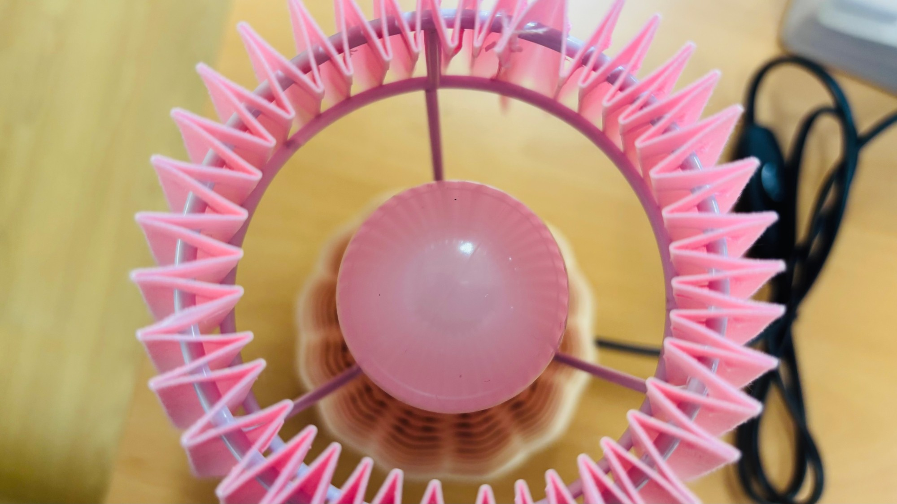
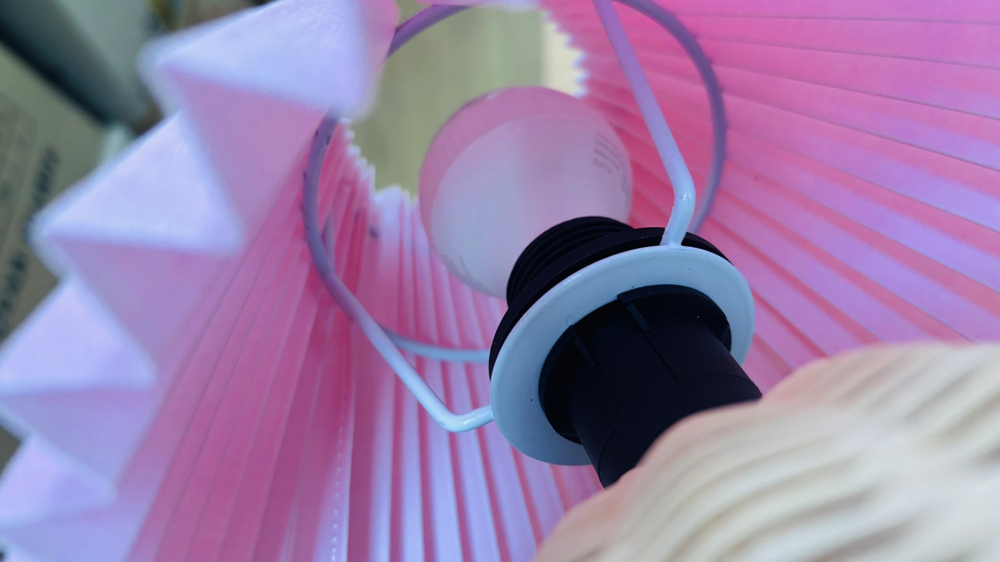
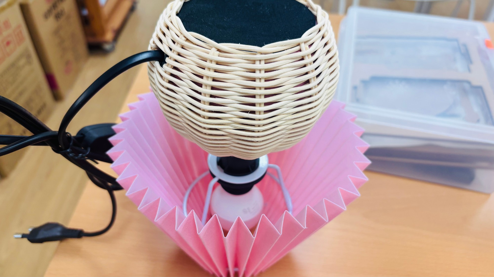
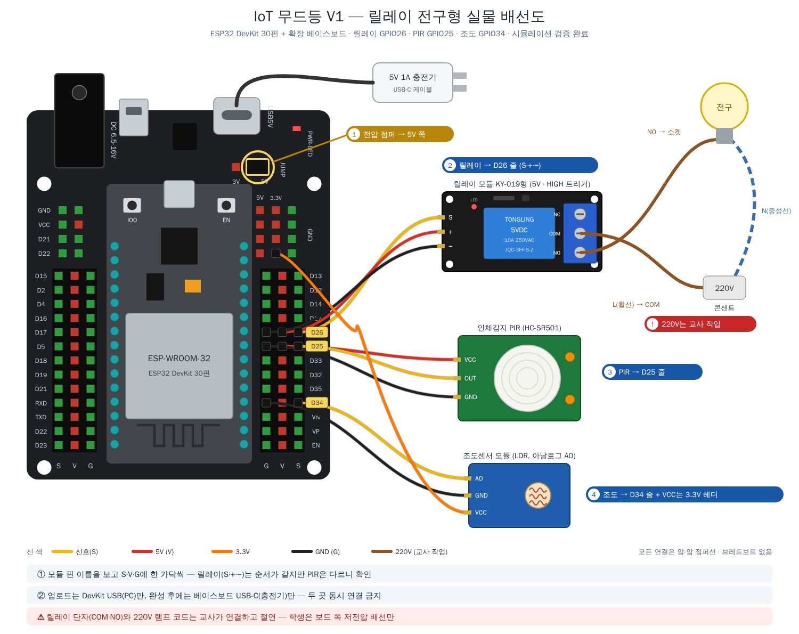

# IoT 무드등 — ESP32 DevKit × 폰 앱 · 음성제어

라탄 받침 + 주름 갓 조명에 **ESP32 DevKit**을 넣어, 핸드폰 앱과 음성으로 제어하고
**조도센서·인체감지센서**로 자동 동작까지 하는 IoT 조명 프로젝트입니다.
**릴레이 전구형(V1)** 과 **네오픽셀 컬러형(V2)** 두 버전으로 나누어 진행합니다.

> 📌 **상태: 준비 단계** — 폴더 구조와 설계 결정 사항을 먼저 정리해 두었습니다.
> 각 단계 폴더의 README에 목표·확인 방법이 적혀 있고, 코드는 단계별로 채워 나갑니다.

| 위에서 본 모습 | 소켓과 흰 고리 (네오픽셀 자리) | 옆에서 본 모습 |
|:---:|:---:|:---:|
|  |  |  |

## 두 가지 버전

| 항목 | [**V1 — 릴레이 전구형**](v1_relay_bulb/) | [**V2 — 네오픽셀 컬러형**](v2_neopixel_color/) |
|---|---|---|
| 학습 목표 | 릴레이를 이용한 전원 제어 | LED의 색·밝기 제어 |
| 조명 | 기존 220V 전구 | 5V 네오픽셀 |
| 켜기·끄기 | 가능 | 가능 |
| 색 변경 | 없음 | 가능 |
| 밝기 조절 | 없음 | 가능 |
| 센서 | 조도센서 + PIR 움직임 감지센서 | 동일 |
| 음성제어 | 전원·모드 변경 | 전원·모드·색·밝기 변경 |
| 전원 플러그 | **2개:** 전구(220V) + 5V 어댑터(1A) | **1개:** 5V 어댑터(2A) |
| 220V 작업 | 있음 — 교사가 직접 | 없음 — 학생이 전부 배선 |

**V1을 먼저 하고 V2로 넘어가는 순서**를 권합니다. 센서·통신 코드와 명령 이름(`ON`·`OFF`·`AUTO`)이 같아서,
V2는 V1의 릴레이 자리를 네오픽셀로 바꾸고 색·밝기 명령만 더하면 됩니다.

## 전원은 몇 개?

- **V1은 2개** — 전구는 220V 교류, ESP32는 5V 직류로 서로 다른 전기를 씁니다. 릴레이는 그 사이의 '스위치'일 뿐입니다.
- **V2는 1개** — 220V 전구를 빼고 조명까지 5V 네오픽셀이 맡으므로 5V 어댑터 하나로 끝납니다.
  대신 네오픽셀 전류가 커서 **2A** 어댑터가 필요합니다.

자세한 이유 → **[`docs/power.md`](docs/power.md)**

## 보드

**ESP32 DevKit 30핀 + 확장 베이스보드**를 씁니다. 핀마다 G·V·S 헤더가 있어 센서를 **브레드보드 없이 바로** 꽂습니다.
전압 점퍼는 5V, 조도센서만 V선을 3.3V 헤더로 따로 연결합니다. → **[`docs/board.md`](docs/board.md)**

> 🔁 **Wemos D1 R32로도 됩니다** — 쉴드 없이 직결하거나 센서쉴드 V5에 꽂기. 코드는 그대로, 꽂는 자리와 전원만 다릅니다 → **[`docs/board_wemos.md`](docs/board_wemos.md)**

| V1 배선도 | V2 배선도 |
|:---:|:---:|
|  |  |

## 왜 중계 서버가 필요한가

AI Studio 앱은 **HTTPS** 주소에서 실행되고, ESP32는 교실 와이파이 안의 **HTTP** 주소(`192.168.x.x`)를 씁니다.
브라우저는 보안상 HTTPS 페이지에서 HTTP 주소로 보내는 요청을 막기 때문에(혼합 콘텐츠 차단)
앱이 ESP32에 직접 명령할 수 없습니다. 그래서 둘 다 접속할 수 있는 Apps Script를 가운데 둡니다.

```
[폰 앱: 버튼 · 슬라이더 · 🎤]                  [ESP32 DevKit 무드등]
   │ ① 명령 보내기 (ON / OFF / COLOR …)           │ ② 1~1.5초마다 "새 명령 있나요?" 폴링
   │ ④ 현재 상태 읽기                              │ ③ 명령 실행 → 현재 상태 보고
   ▼                                            ▼
   └──────────▶  Apps Script 중계 서버  ◀────────┘
                        │
                        ▼
                구글 시트 (명령 큐 / 상태 / 기록)
```

> ⏱ 폴링 구조라 반응이 **수 초 늦을 수 있습니다.** V2의 밝기 슬라이더는 **손을 뗄 때 한 번만** 전송하도록 만들어요.

## 폴더 안내

| 폴더 | 내용 |
|---|---|
| [`docs/board.md`](docs/board.md) | 보드(DevKit + 확장 베이스보드) 쓰는 법 — 전압 점퍼 · 꽂는 줄 · 전원 |
| [`docs/board_wemos.md`](docs/board_wemos.md) | **Wemos D1 R32 판** — 쉴드 없이 직결 / 센서쉴드 V5 · 꽂는 자리 · 전원 · 배선도 |
| [`sim/`](sim/README.md) | **시뮬레이터** — 보드 없이 PC에서 펌웨어·배선 점검 (`make run`) |
| [`docs/parts.md`](docs/parts.md) | 부품 목록과 고른 이유 — 버전별 필요 부품 표시 |
| [`docs/power.md`](docs/power.md) | V1은 플러그 2개, V2는 1개인 이유 · 어댑터 용량 |
| [`docs/voice_control.md`](docs/voice_control.md) | 음성제어 방법 (Web Speech API · Gemini · Siri 단축어) |
| [`v1_relay_bulb/`](v1_relay_bulb/) | **V1** — 배선 · 단계별 펌웨어 4단계 · 중계서버 · 앱 |
| [`v2_neopixel_color/`](v2_neopixel_color/) | **V2** — 배선 · 단계별 펌웨어 3단계 · 중계서버 · 앱 |

## 확정 전 확인할 것

- [ ] (V1) **전구 종류** — 220V LED 전구인지 확인
- [ ] (V1) **릴레이 트리거 방식** — 산 모듈이 LOW에서 켜지는지(active-LOW), HIGH에서 켜지는지
- [ ] **받침 안 공간** — DevKit + (V1) 릴레이 + 배선이 들어가는지, PIR 렌즈를 밖으로 낼 구멍 위치
- [ ] **조도센서 위치** — 램프 자기 빛이 닿지 않는 곳
- [ ] **시연 폰** — 음성은 안드로이드 Chrome / 아이폰 Safari(iOS 14.5+)에서 테스트
- [ ] (V2) **소켓 바깥지름 실측** — 네오픽셀 링 안지름이 이보다 2~3mm 커야 흰 고리 위에 얹힘
- [ ] (V2) **네오픽셀 밝기** — 조명으로 충분한지 1단계에서 확인 (부족하면 LED 수·어댑터 용량 키우기)

## 꼭 알아두기

- ⚠️ **(V1) 220V 배선은 교사가 직접.** 학생 작업은 5V 저전압 쪽까지. V2는 220V를 쓰지 않습니다.
- **릴레이는 켜기/끄기만** 합니다. V1에 밝기 조절이 없는 이유입니다 — 색·밝기는 V2에서 네오픽셀로.
- **조도센서는 GPIO34(ADC1)에.** ADC2 핀은 와이파이를 켜면 아날로그 값을 못 읽어요.
- **인체감지 기록은 곧 '재실 기록'** 입니다. 시트에 무엇을 남기고 무엇을 남기지 않을지 팀에서 먼저 정하세요.
