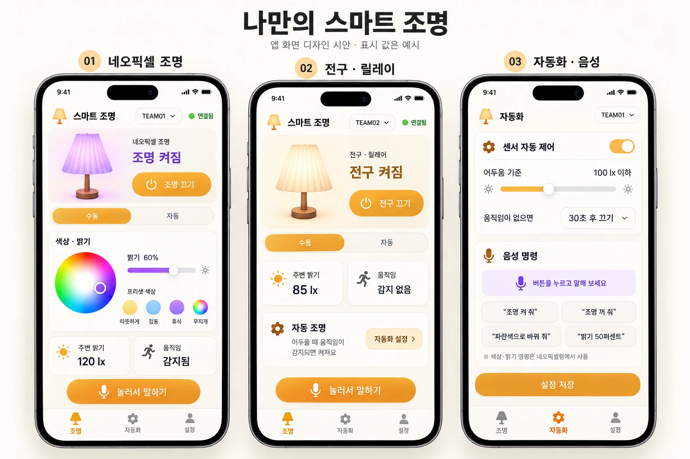

# AI Studio 앱 프롬프트 — 나만의 스마트 조명



V1(네오픽셀)과 V2(전구·릴레이)를 **앱 하나**로 제어합니다. 화면은 시안대로 3개입니다.
**01 네오픽셀 조명** · **02 전구·릴레이** · **03 자동화·음성**, 아래 탭은 **조명 · 자동화 · 설정**입니다.
반 전체가 **구글 시트 1개(서버 주소 1개)** 를 같이 쓰고, 앱에서 **내 팀(TEAM01~TEAM12)** 을 골라 씁니다.

## 쓰는 순서

1. 선생님이 [중계 서버](../apps_script/README.md)를 배포해 **웹앱 URL(끝이 `/exec`)** 을 나눠 줍니다.
2. 아래 [전체 프롬프트](#전체-프롬프트-그대로-붙여넣기)를 복사하고, **`[웹앱 URL]` 두 곳을 실제 주소로 바꿉니다.**
   (바꾸지 않으면 AI가 엉뚱한 주소를 지어냅니다)
3. AI Studio → **Build → New App**에 붙여 넣습니다. 위 시안 이미지를 함께 첨부할 수 있으면 첨부합니다.
4. 앱이 열리면 **설정 탭에서 내 팀**을 고릅니다. 내 보드가 켜져 있으면 보드 종류(전구/네오픽셀)에 맞는 화면이 자동으로 나옵니다.
5. 마이크 버튼이 반응하지 않으면 `metadata.json`의 `requestFramePermissions`에 `"microphone"`이 있는지 확인합니다.
6. 시안과 다른 곳은 [다듬기 지시문](#다듬기-지시문-한-번에-하나씩)으로 **한 번에 하나씩** 고칩니다.

## 시안과 달라진 점

| 시안 | 프롬프트 | 이유 |
|---|---|---|
| 주변 밝기 `85 lx` | `밝기 32%` | 조도센서 모듈은 lx가 아니라 전압 값을 냅니다. 보드가 0~100%로 바꿔 보냅니다 (lx로 쓰려면 보정 또는 BH1750 센서 필요) |
| 어두움 기준 `100 lx 이하` | `30% 이하` | 위와 같은 이유 |
| 헤더 `TEAM01` | 내 팀 + 12팀 연결 상태 | 반 전체가 서버 하나를 같이 쓰기 때문 |

---

## 전체 프롬프트 (그대로 붙여넣기)

````
'나만의 스마트 조명' 모바일 웹앱(PWA)을 만들어줘.
ESP32로 만든 무드등을 폰으로 켜고 끄고, 색·밝기를 바꾸고, 자동 동작과 음성 명령을 설정하는 앱이야.
반 전체 12팀(TEAM01~TEAM12)이 같은 서버 주소를 쓰고, 앱에서 내 팀을 골라서 내 무드등만 제어해.

━━━━━━━━━━ 공통 레이아웃 ━━━━━━━━━━
- 모바일 우선(폭 390px 기준), 화면 하나에 카드가 세로로 쌓이는 구조
- 맨 위 헤더: 왼쪽에 주황색 램프 아이콘 + 화면 제목, 오른쪽에 내 팀 드롭다운(TEAM01~TEAM12)과
  연결 상태 표시(초록 점 + "연결됨" / 회색 점 + "연결 끊김")
- 맨 아래 탭바 3개: [조명] [자동화] [설정] — 아이콘 + 글자, 선택된 탭은 주황색

━━━━━━━━━━ 디자인 규칙 ━━━━━━━━━━
- 배경: 따뜻한 미색 #FBF8F3
- 카드: 흰색, 모서리 둥글게(20px), 아주 옅은 그림자, 카드 사이 간격 12px
- 주 색상: 주황 그라데이션 #F7A928 → #F08A1C (큰 버튼, 선택된 탭, 토글)
- 네오픽셀 화면의 강조색: 보라 #8B5CF6 (상태 글자, 밝기 슬라이더)
- 글꼴: Pretendard(없으면 시스템 고딕), 상태 글자는 크고 굵게
- 큰 버튼은 알약 모양(높이 56px 이상), 손가락으로 누르기 쉽게
- 아이콘은 선 아이콘(lucide 계열)

━━━━━━━━━━ 화면 1 · 조명 탭 (내 보드가 네오픽셀일 때: type = "neopixel") ━━━━━━━━━━
1) 상태 카드: 왼쪽에 주름 갓 램프 그림. 갓 색은 현재 네오픽셀 색으로 칠하고 은은하게 빛나게
   (color가 rainbow면 갓을 무지개 그라데이션으로).
   오른쪽에 작은 글씨 "네오픽셀 조명", 큰 글씨 "조명 켜짐"(보라) 또는 "조명 꺼짐"(회색),
   그 아래 주황 버튼 "⏻ 조명 끄기" / "⏻ 조명 켜기"
2) [수동 | 자동] 세그먼트 버튼 — 현재 모드를 주황으로 표시
3) "색상 · 밝기" 카드:
   - 왼쪽에 원형 컬러휠(터치해서 색 고르기)
   - 오른쪽에 "밝기 60%" 글자와 밝기 슬라이더(0~100)
   - 프리셋 색 버튼 4개: 따뜻하게(warm) · 집중(white) · 휴식(purple) · 무지개(rainbow)
4) 센서 카드 2개를 가로로: "☀ 주변 밝기 32%" / "🏃 움직임 감지됨"(또는 "감지 없음")
5) 맨 아래 큰 주황 버튼 "🎤 눌러서 말하기"

━━━━━━━━━━ 화면 2 · 조명 탭 (내 보드가 전구일 때: type = "bulb") ━━━━━━━━━━
화면 1과 같은 틀이지만:
1) 상태 카드: 갓 색은 따뜻한 미색, 작은 글씨 "전구 · 릴레이", 큰 글씨 "전구 켜짐"(주황) / "전구 꺼짐",
   버튼 "⏻ 전구 끄기" / "⏻ 전구 켜기"
2) [수동 | 자동] 세그먼트 버튼
3) 센서 카드 2개: "☀ 주변 밝기 32%" / "🏃 움직임 감지 없음"
4) "자동 조명" 카드: 톱니 아이콘, 제목 "자동 조명", 설명 "어두울 때 움직임이 감지되면 켜져요",
   오른쪽에 "자동화 설정 >" 버튼(누르면 자동화 탭으로 이동)
5) 맨 아래 "🎤 눌러서 말하기" 버튼
(색상·밝기 카드는 전구 보드에서는 숨김 — 전구는 켜기/끄기만 가능)

내 보드가 한 번도 연결된 적 없으면(type 없음) 조명 탭에 "보드를 켜고 와이파이에 연결해 주세요" 안내 카드만 보여줘.

━━━━━━━━━━ 화면 3 · 자동화 탭 ━━━━━━━━━━
1) "센서 자동 제어" 카드: 오른쪽에 주황 토글 스위치 (켜짐 = 자동 모드)
   - "어두움 기준" 슬라이더(0~100%) — "30% 이하"처럼 표시, 양끝에 해 아이콘(작은/큰)
   - "움직임이 없으면" 드롭다운: 30초 후 끄기 / 1분 / 5분 / 10분
   - 두 값의 처음 값은 서버 상태의 dark, off로 채워줘 (없으면 30%, 5분)
2) "음성 명령" 카드: 마이크 아이콘
   - 연보라 배경의 큰 버튼 "🎤 버튼을 누르고 말해 보세요"
   - 예시 문장 칩 4개(누르면 그 명령을 바로 실행): "조명 켜 줘" · "조명 꺼 줘" · "파란색으로 바꿔 줘" · "밝기 50퍼센트"
   - 작은 회색 글씨: "※ 색상·밝기 명령은 네오픽셀형에서 사용"
3) 맨 아래 큰 주황 버튼 "설정 저장"

━━━━━━━━━━ 설정 탭 ━━━━━━━━━━
- "내 팀" 선택: TEAM01 ~ TEAM12 중 하나 (localStorage에 저장, 헤더 드롭다운과 같은 값)
- "반 전체 연결 현황": 12팀을 3열 격자로, 팀마다 초록/회색 점 + 보드 종류(전구/네오픽셀) 표시
  — [웹앱 URL]?mode=teams 를 10초마다 읽어서 표시
- 서버 주소는 화면에 작게 표시만 (수정 불가)

━━━━━━━━━━ 동작 규칙 (가장 중요) ━━━━━━━━━━
- 서버 주소는 [웹앱 URL] 하나뿐이야. 서버를 새로 만들지 말고, 이 앱에 API나 백엔드를 만들지 마.
  모든 요청에 &team=내팀 (예: team=TEAM03) 을 꼭 붙여.
- 상태 읽기: 3초마다 GET [웹앱 URL]?mode=state&team=내팀
  응답 JSON 예: {"ok":true,"online":true,"type":"neopixel","power":"ON","auto":1,"color":"warm","bright":60,
                "light":32,"motion":1,"dark":30,"off":300}
  · online → 헤더 "연결됨"/"연결 끊김" (요청이 실패해도 "연결 끊김")
  · type → "neopixel"이면 화면 1, "bulb"이면 화면 2
  · power "ON"/"OFF" → 켜짐/꺼짐,  auto 1/0 → 자동/수동
  · color, bright → 색·밝기 (color는 warm·white·red·orange·yellow·green·blue·purple·pink·rainbow 또는 6자리 색 코드)
  · light → 주변 밝기 % 그대로 표시,  motion 1/0 → "감지됨"/"감지 없음"
  · dark, off → 자동화 탭 처음 값
- 명령 보내기: GET [웹앱 URL]?mode=set&team=내팀&cmd=명령&value=값 (명령 이름은 대문자 그대로)
  · 켜기/끄기 버튼: cmd=ON / cmd=OFF
  · 세그먼트 [자동] 또는 자동화 토글 켜기: cmd=AUTO
  · 세그먼트 [수동] 또는 자동화 토글 끄기: 지금 켜져 있으면 cmd=ON, 꺼져 있으면 cmd=OFF (켜짐 상태는 그대로, 수동으로만 바뀜)
  · 프리셋 색: cmd=COLOR&value=warm / white / purple / rainbow
  · 컬러휠: cmd=COLOR&value=6자리 색 코드(# 없이, 예: FF8800)
  · 밝기 슬라이더: cmd=BRIGHT&value=0~100 — 손을 뗄 때(change 이벤트) 한 번만 보내. 움직이는 동안 보내지 마.
  · 자동화 탭 "설정 저장": cmd=CONFIG&dark=어두움기준(0~100)&off=꺼짐초(30/60/300/600)
- 버튼을 누르면 화면을 먼저 바꾸고(낙관적 갱신), 다음 상태 읽기에서 실제 값으로 맞춰.
  보드가 명령을 가져가기까지 2~3초 걸려. 명령을 보낸 뒤 3초 동안 버튼에 작은 로딩 표시를 해줘.
  요청이 실패하면 "서버에 전달하지 못했어요" 토스트를 2초 보여줘.

━━━━━━━━━━ 음성 명령 ━━━━━━━━━━
- 브라우저 Web Speech API(SpeechRecognition, 없으면 webkitSpeechRecognition), lang='ko-KR'
- "눌러서 말하기" 버튼을 누르면 한 문장을 듣고, 들은 문장을 화면에 잠깐 보여준 뒤 아래 규칙으로 명령을 보내:
  · '꺼' 포함 → OFF / '켜' 포함 → ON / '자동' 포함 → AUTO   ('꺼'를 '켜'보다 먼저 검사)
  · 색 단어 → COLOR: 빨강→red, 주황→orange, 노랑→yellow, 초록→green, 파랑·파란→blue,
    보라→purple, 분홍→pink, 따뜻→warm, 하양·흰→white, 무지개→rainbow
  · '밝기'와 숫자 → BRIGHT(숫자), '밝게' → 현재 밝기+20, '어둡게' → 현재 밝기−20 (0~100으로 제한)
  · 전구 보드에서 색·밝기 명령이 들리면 보내지 말고 "전구는 켜기/끄기만 할 수 있어요"라고 안내
  · 알아듣지 못하면 "다시 말해 주세요" 안내
- 이 브라우저가 음성 인식을 지원하지 않으면 마이크 버튼을 회색으로 바꾸고
  "안드로이드는 Chrome, 아이폰은 Safari에서 열어 주세요" 안내

━━━━━━━━━━ 기타 ━━━━━━━━━━
- 홈 화면에 추가할 수 있는 PWA로 (앱 이름 "스마트 조명", 아이콘은 주황 램프)
- 로그인 기능은 만들지 마.
````

---

## 다듬기 지시문 (한 번에 하나씩)

| 시안과 다를 때 | 한 문장 지시 |
|---|---|
| 램프 그림이 밋밋함 | "상태 카드의 램프를 주름 갓 + 나무 받침 모양으로, 켜졌을 때 갓 뒤로 은은한 빛 번짐을 넣어줘" |
| 색이 너무 진함 | "배경은 #FBF8F3, 카드는 흰색, 주황은 버튼과 선택된 탭에만 써줘" |
| 컬러휠이 없음 | "색상 카드 왼쪽에 원형 컬러휠을 넣고, 고른 색을 6자리 색 코드로 COLOR 명령에 보내줘" |
| 슬라이더가 계속 요청을 보냄 | "밝기 슬라이더는 input이 아니라 change 이벤트에서만 요청을 보내줘" |
| 다른 팀 램프가 켜짐 | "모든 요청에 &team=내팀 을 붙이고, 내팀은 설정 탭에서 고른 값을 써줘" |
| 마이크가 반응 없음 | "metadata.json의 requestFramePermissions에 microphone을 추가해줘" |
| 주소를 지어냄 | "서버 주소를 새로 만들지 말고, 프롬프트에 적은 웹앱 URL만 사용해줘" |

## 함께 보는 문서

- 서버 주소 약속: [`../apps_script/README.md`](../apps_script/README.md)
- 보드 펌웨어: [V1 네오픽셀](../v1_neopixel/firmware/step4_app_mood_lamp/) · [V2 전구](../v2_relay_bulb/firmware/step4_app_lamp/)
- 음성 규칙: [`../docs/voice_control.md`](../docs/voice_control.md)
