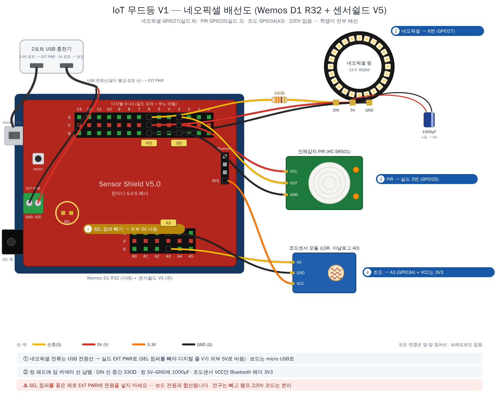

# 보드 — Wemos D1 R32 + 아두이노 센서쉴드 V5

두 버전 모두 **Wemos D1 R32** 위에 **아두이노 센서쉴드 V5**를 꽂아서 씁니다.
실드에는 핀마다 **G·V·S 3핀 헤더**가 있어서, 센서를 **브레드보드 없이 바로** 꽂습니다.

- D1 R32는 우노 모양이지만 칩은 **ESP32(WROOM-32)** 입니다. 코드에서는 실드에 인쇄된 숫자가 아니라 **GPIO 번호**를 씁니다.
- 실드의 **숫자 = 우노 라벨**입니다. 이 프로젝트가 쓰는 자리만 외우면 됩니다 (아래 표).

| V1 네오픽셀 | V2 릴레이 전구 |
|:---:|:---:|
|  |  |

## 꽂는 자리

| 부품 | 실드 자리 | GPIO (코드) | V1 | V2 |
|---|:---:|:---:|:---:|:---:|
| 네오픽셀 링 | **6번** | 27 | ✅ | — |
| 릴레이 | **2번** | 26 | — | ✅ |
| 인체감지(PIR, HC-SR501) | **3번** | 25 | ✅ | ✅ |
| 조도센서 | **A3** (S·G) + **Bluetooth 헤더 3V3** (VCC) | 34 | ✅ | ✅ |

- 모듈 핀 이름을 보고 **S·V·G에 한 가닥씩** 맞춰 꽂습니다 (모듈마다 핀 순서가 다름). 모듈 핀은 수, 실드 헤더도 수이므로 **암-암 점퍼선**입니다.
- **조도센서만 VCC를 따로**: 실드의 V는 5V라서, 그대로 꽂으면 출력이 3.3V를 넘어 ESP32 입력 핀에 무리를 줍니다.
  실드의 **Bluetooth 헤더에 있는 3V3 핀**에 VCC를 연결합니다 (실드에 인쇄된 `3V3` 표기를 확인).
- **GPIO34는 입력 전용(ADC1)** 이라 와이파이를 켜도 아날로그 값을 읽을 수 있습니다. 다른 아날로그 핀(A0·A1 = GPIO2·4)은 와이파이를 켜면 못 읽습니다.

## 전원 — SEL 점퍼가 핵심

센서쉴드의 **SEL 점퍼**는 디지털 0~13번 줄의 V를 어디서 받을지 고릅니다.

| | SEL 점퍼 | 디지털 줄 V 전원 | 보드 전원 | 플러그 |
|---|:---:|---|---|:---:|
| **V1 네오픽셀** | **뺌** | 실드 **EXT PWR 단자**에 외부 5V | micro USB | **1개** (2포트 충전기) |
| **V2 릴레이 전구** | **꽂음** | 보드 5V | micro USB에 **5V 1A 충전기** | **2개** (+ 전구 220V) |

V1은 네오픽셀이 1A 가까이 쓸 수 있어서, 보드를 거치지 않고 **EXT PWR 단자로 따로** 넣습니다.
**2포트 USB 충전기(2.4A 포트 + 1A 포트)** 하나로 ① 1A 포트 → 보드 micro USB, ② 2.4A 포트 → USB 전원선(끝이 빨강·검정 선) → EXT PWR을 함께 쓰면
콘센트 플러그는 **1개**입니다. 자세한 전류 계산 → [`power.md`](power.md)

> ⚠ **SEL 점퍼를 꽂은 채로 EXT PWR에 전원을 넣지 마세요.** 보드 전원과 외부 전원이 합선됩니다.
> ⚠ 코드를 업로드할 때 PC USB와 충전기를 동시에 보드에 꽂지 않습니다.

## 피해야 할 핀

| 핀 | 이유 |
|---|---|
| GPIO 0 · 2 · 12 · 15 | 부팅 모드에 영향 (부팅·업로드 실패 원인) — 실드 A0(2) · 8(12) 자리 |
| GPIO 1 · 3 | USB 시리얼(업로드·시리얼 모니터) — 실드 0·1번 자리 |
| GPIO 34 · 35 · 36 · 39 | **입력 전용** — 센서 읽기만, 출력 불가 — 실드 A2~A5 자리 |

참고: 센서쉴드 V5의 SEL 점퍼·Bluetooth 헤더 3V3 → [ProtoSupplies — Sensor Shield V5.0](https://protosupplies.com/product/sensor-shield-v5-0/)
