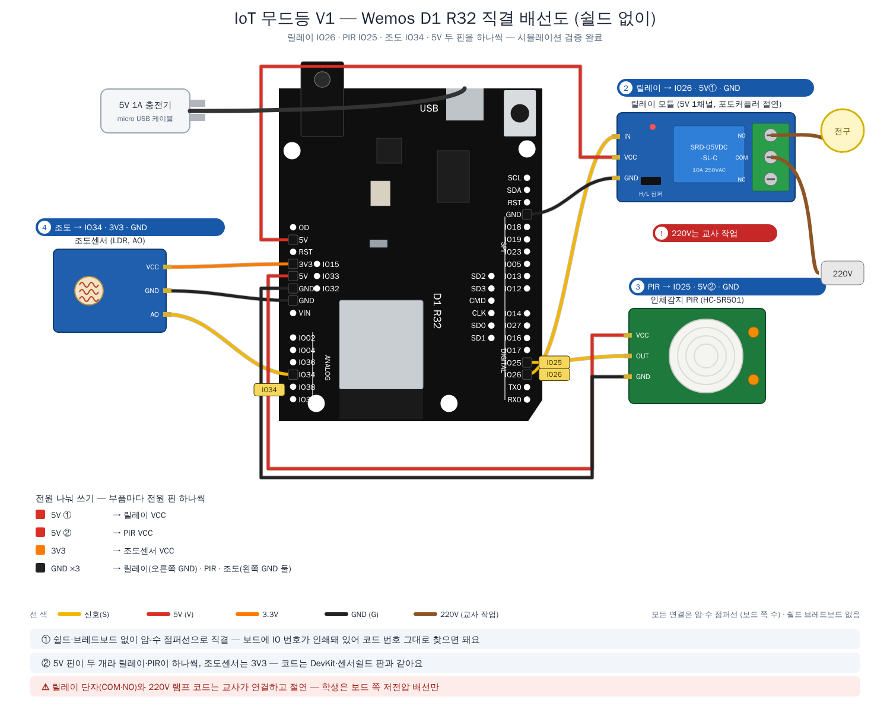
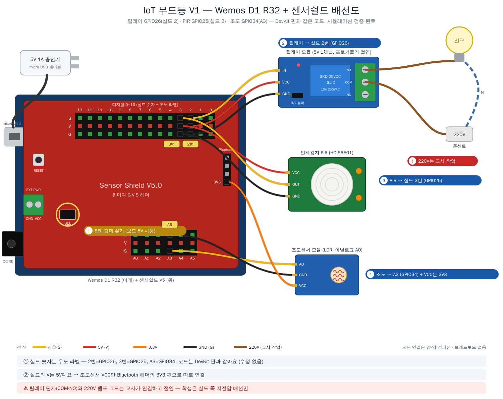

# Wemos D1 R32로 만들기 — 쉴드 없이 직결 / 센서쉴드 V5

**Wemos D1 R32로도 똑같이 만들 수 있습니다.** DevKit과 같은 ESP32(WROOM-32) 칩이고 GPIO 번호가 같아서
**펌웨어는 한 글자도 바꾸지 않습니다** (`sim/check_wiring.py`가 펌웨어 핀과 두 보드 배선표가 같은지 자동 확인).
달라지는 것은 **꽂는 자리와 전원 연결**뿐입니다.

만드는 방법은 두 가지이고, 둘 다 브레드보드가 필요 없습니다.

| | ① 쉴드 없이 직결 | ② 센서쉴드 V5 |
|---|---|---|
| 준비물 | 암-수 점퍼선만 | 아두이노 센서쉴드 V5 + 암-암 점퍼선 |
| V1 릴레이 전구형 | ✅ 그대로 | ✅ |
| V2 네오픽셀 컬러형 | ✅ 단, 밝기 상한 `MAX_BRIGHTNESS` 128 → **64** | ✅ 밝기 그대로 (EXT PWR로 전원 따로) |

## ① 쉴드 없이 직결

D1 R32 전원 헤더에는 **5V 핀이 두 개**(5V · RST · 3V3 · **5V** · GND · GND · VIN) 있어서,
5V가 필요한 부품 둘(릴레이·PIR 또는 네오픽셀·PIR)이 **하나씩** 쓰면 됩니다. 보드에 **IO 번호가 그대로 인쇄**되어 있어
코드의 번호와 같은 글자를 찾아 꽂으면 됩니다. 센서 핀은 수, 보드 헤더는 구멍이므로 **암-수 점퍼선**을 씁니다.

| V1 릴레이 전구형 | V2 네오픽셀 컬러형 |
|:---:|:---:|
|  |  |

| 부품 | 신호 | 전원 | GND |
|---|:---:|:---:|:---:|
| 릴레이 (V1) / 네오픽셀 (V2) | **IO26** / **IO27** (오른쪽 줄) | **5V ①** | 오른쪽 GND (IO18 위) |
| PIR | **IO25** (오른쪽 줄) | **5V ②** | 왼쪽 GND |
| 조도센서 | **IO34** (왼쪽 ANALOG 줄) | **3V3** | 왼쪽 GND |

- **V2는 밝기 상한을 낮춥니다.** 네오픽셀 전류가 micro USB → 보드 → 5V 핀으로 나가는데, 이 경로가 얼마까지 견디는지
  보드 사양을 확인하지 못했습니다. 펌웨어의 `MAX_BRIGHTNESS`를 **128 → 64**로 바꾸면 최대 전류가 약 884mA → 562mA로 줄어듭니다
  (`sim/check_wiring.py` 계산). 더 밝게 쓰려면 ② 센서쉴드 판이나 DevKit 베이스보드 판을 쓰세요.
- 보드 그림의 ANALOG 줄 라벨 중 `IO38`은 ESP32 모듈이 내보내지 않는 핀이라 그림 오기로 보입니다(실물은 보통 IO35).
  우리가 쓰는 **IO34는 어느 쪽이든 같은 자리(위에서 4번째)**라 영향이 없습니다.

## ② 센서쉴드 V5 사용

D1 R32 위에 **아두이노 센서쉴드 V5**를 꽂으면 핀마다 G·V·S 헤더가 생겨 센서를 바로 꽂을 수 있습니다.

| V1 릴레이 전구형 | V2 네오픽셀 컬러형 |
|:---:|:---:|
|  |  |

### 꽂는 자리 (실드 숫자 = 우노 라벨)

| 부품 | 실드 자리 | GPIO (코드) | DevKit 판 | V1 | V2 |
|---|:---:|:---:|:---:|:---:|:---:|
| 릴레이 | **2번** | 26 | D26 줄 | ✅ | — |
| 네오픽셀 링 | **6번** | 27 | D27 줄 | — | ✅ |
| 인체감지(PIR) | **3번** | 25 | D25 줄 | ✅ | ✅ |
| 조도센서 | **A3** (S·G) + **Bluetooth 헤더 3V3** (VCC) | 34 | D34 줄 + 3.3V 헤더 | ✅ | ✅ |

- 모듈 핀 이름을 보고 **S·V·G에 한 가닥씩** 맞춰 꽂습니다 (모듈마다 핀 순서가 다름).
- **조도센서만 VCC를 따로**: 실드의 V는 5V라서, 그대로 꽂으면 출력이 3.3V를 넘을 수 있습니다.
  실드의 **Bluetooth 헤더에 있는 3V3 핀**에 VCC를 연결합니다 (실드에 인쇄된 `3V3` 표기를 확인하세요).

### 전원 — SEL 점퍼가 핵심

센서쉴드의 **SEL 점퍼**는 디지털 0~13번 줄의 V를 어디서 받을지 고릅니다.

| | SEL 점퍼 | 디지털 줄 V 전원 | 보드 전원 |
|---|:---:|---|---|
| **V1** | **꽂음** | 보드 5V | micro USB에 **5V 1A 충전기** |
| **V2** | **뺌** | 실드 **EXT PWR 단자**에 외부 5V | micro USB |

V2는 네오픽셀이 1A 가까이 쓸 수 있어서, 보드를 거치지 않고 **EXT PWR 단자로 따로** 넣습니다.
**2포트 USB 충전기(합계 2.4A 이상)** 하나로 ① 보드 micro USB와 ② USB 전원선(끝이 빨강·검정 선) → EXT PWR을 함께 쓰면
**콘센트 플러그는 그대로 1개**입니다.

> ⚠ **SEL 점퍼를 꽂은 채로 EXT PWR에 전원을 넣지 마세요.** 보드 전원과 외부 전원이 합선됩니다.
> ⚠ 코드를 업로드할 때 PC USB와 충전기를 동시에 보드에 꽂지 않습니다.

## DevKit 판과 비교

| | DevKit + 확장 베이스보드 | Wemos 직결 | Wemos + 센서쉴드 |
|---|---|---|---|
| 코드 | 같음 | 같음 (V2는 밝기 상한 64) | 같음 |
| 크기 | 작음 — 받침 안에 넣기 쉬움 | 우노 크기 | 우노 크기 + 실드 — 가장 큼 |
| 5V 전원 나누기 | G·V·S 헤더마다 V | 보드 5V 핀 두 개 | 실드 G·V·S 헤더마다 V |
| 3.3V 꺼내는 곳 | 위쪽 3.3V 헤더 | 보드 3V3 핀 | Bluetooth 헤더의 3V3 핀 |
| V2 전원 | USB-C 하나 | micro USB 하나 (밝기 낮춤) | 2포트 충전기 (보드 + EXT PWR) |

참고: 센서쉴드 V5의 SEL 점퍼·Bluetooth 헤더 3V3 → [ProtoSupplies — Sensor Shield V5.0](https://protosupplies.com/product/sensor-shield-v5-0/)
