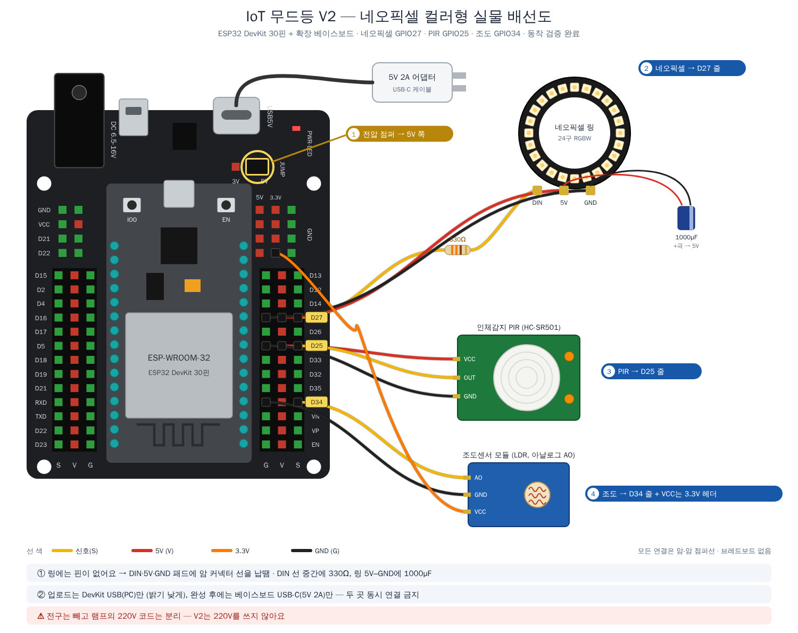
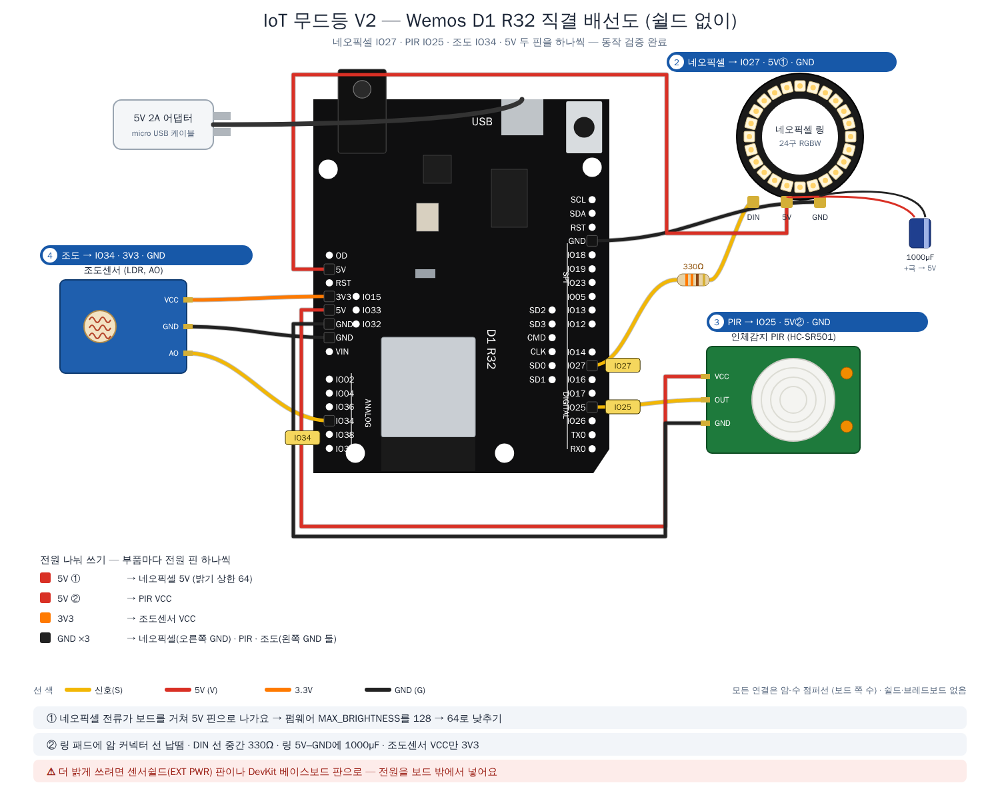
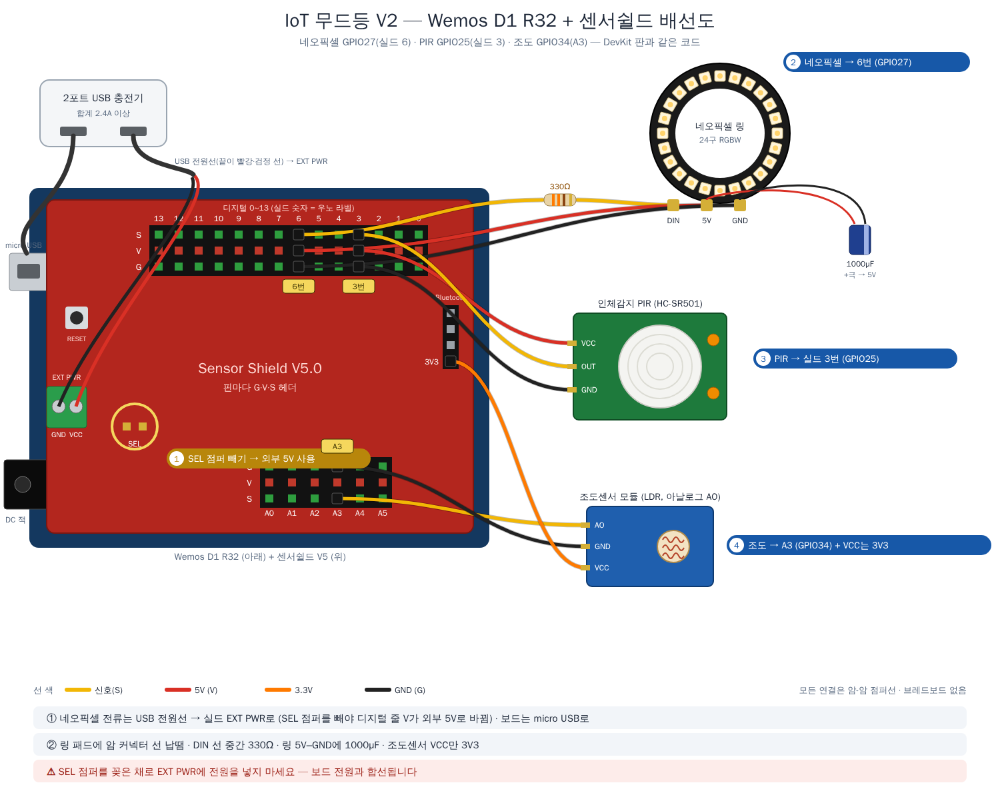

# V2 배선 — 네오픽셀 컬러형

**220V를 쓰지 않습니다.** 모든 배선이 5V 이하라 학생이 직접 작업할 수 있습니다.

## 램프 준비 (시작 전에 한 번)

- 소켓에서 **전구를 빼고**, 램프의 **220V 코드는 분리**합니다 (또는 플러그에 '사용 금지' 표시).
  → 누군가 220V 플러그를 꽂아 빈 소켓에 손이 닿는 일을 막기 위해서입니다.
- 네오픽셀 링은 소켓 흰 고리 위(또는 전구가 있던 자리)에 고정하고, 5V 선은 받침 아래로 뺍니다.

## 베이스보드에 바로 꽂기

브레드보드 없이 **베이스보드의 G·V·S 헤더**에 꽂습니다. 보드 설명 → [`../docs/board.md`](../docs/board.md)
**전압 점퍼는 5V.** 220V가 없으므로 학생이 전부 작업할 수 있습니다.



| 부품 | 꽂는 곳 | 부품 핀 → 헤더 | 이유 |
|---|:---:|---|---|
| 네오픽셀 링 | **D27 줄** | DIN → S · 5V → V · GND → G | 일반 출력 핀, 네오픽셀은 5V |
| 인체감지(PIR) | **D25 줄** | OUT → S · VCC → V · GND → G | V1과 같음 |
| 조도센서 | **D34 줄** + 3.3V 헤더 | AO → S · GND → G · **VCC → 위쪽 3.3V 헤더** | V1과 같음 — 출력이 3.3V를 넘지 않도록 |

### 네오픽셀 링 준비 (납땜 — 한 번만)

링에는 핀 대신 납땜 패드(DIN · 5V · GND)가 있으므로, **암 커넥터가 달린 선 3가닥**을 납땜해 헤더에 꽂게 만듭니다.

| 부품 | 위치 | 이유 |
|---|---|---|
| **300~500Ω 저항** | DIN 선 중간 (링 가까이), 수축튜브로 감싸기 | 신호선 보호 (첫 LED 손상 방지) |
| **1000µF 커패시터** | 링의 5V–GND 패드 사이 (+극 → 5V) | 전원 켤 때 순간 전류 흡수 |

- 신호선은 **짧게.** 받침 안 보드에서 소켓 위 링까지의 거리만큼만.
- 네오픽셀 신호는 3.3V이고 규격상 기준(5V 전원일 때 약 3.5V)보다 살짝 낮습니다.
  대부분 동작하지만 색이 튀거나 깜빡이면 **74AHCT125 레벨시프터**를 넣습니다.

## 전원 — 플러그 1개

```
[5V 2A 어댑터] ──USB-C──▶ 베이스보드 5V ──▶ ESP32 DevKit
   (플러그 1개)                         ──▶ G·V·S 헤더 V(5V) ──▶ 네오픽셀, PIR
                                      ──▶ 3.3V 헤더 ──────────▶ 조도센서 VCC
```

| 시기 | 연결 | 주의 |
|---|---|---|
| **개발 중** (코드 업로드) | DevKit USB(PC)만 | PC USB 전류가 작으므로 코드에서 `setBrightness()` 를 낮게(예: 30) |
| **완성 후** | 베이스보드 USB-C에 **5V 2A 어댑터**만 | DevKit USB는 뺌 |

> **두 곳에 동시에 전원을 넣지 않습니다.** 제품에 따라 전원이 거꾸로 흘러 PC USB 포트나 어댑터가 상할 수 있습니다.
> DC 잭(6.5~16V)은 보드 안 레귤레이터가 열을 많이 내므로, 네오픽셀을 쓰는 V2는 **USB-C 5V 입력**을 권합니다.
> 24구 링(밝기 상한 128에서 약 1A)은 G·V·S 헤더로 충분합니다. LED를 더 늘려 전류가 커지면 네오픽셀 5V·GND를 **위쪽 5V·GND 전원 헤더**에서 받습니다.

## Wemos D1 R32로 할 때

코드는 그대로이고 **쉴드 없이 직결**하거나 **센서쉴드 V5**에 꽂습니다 → [`../docs/board_wemos.md`](../docs/board_wemos.md)

> 쉴드 없이 직결할 때는 펌웨어의 `MAX_BRIGHTNESS`를 128 → **64**로 낮추세요.

| 쉴드 없이 직결 | 센서쉴드 V5 |
|:---:|:---:|
|  |  |
