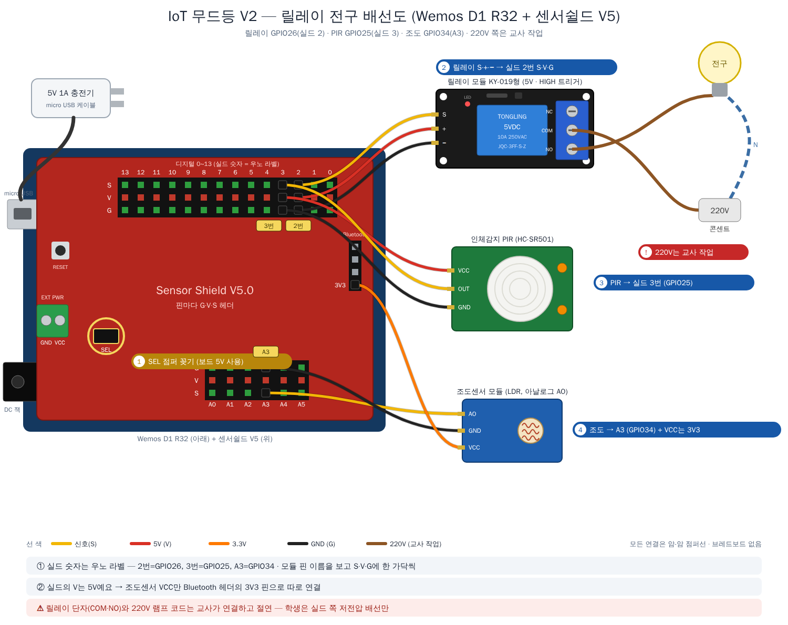

# V2 배선 — 릴레이 전구 (Wemos D1 R32 + 센서쉴드 V5)

## ⚠️ 가장 중요한 것 하나

**220V 배선(전구 ↔ 릴레이)은 교사가 직접 합니다.** 학생은 아래 '실드 쪽 배선'까지만 작업합니다.



## 실드 쪽 배선 (학생 작업) — SEL 점퍼 꽂음

보드 설명 → [`../docs/board.md`](../docs/board.md)

| 부품 | 실드 자리 | 부품 핀 → 헤더 | 비고 |
|---|:---:|---|---|
| 릴레이 (KY-019형) | **2번** (GPIO26) | **S → S · 가운데(+) → V · − → G** | 핀 순서가 헤더와 같아 3핀을 나란히 꽂음. HIGH 트리거 → `RELAY_ACTIVE_LOW = false` |
| 인체감지(PIR) | **3번** (GPIO25) | OUT → S · VCC → V · GND → G | HC-SR501은 5V 전원, 출력 3.3V |
| 조도센서 | **A3** (GPIO34) + Bluetooth 헤더 **3V3** | AO → S · GND → G · **VCC → 3V3** | 출력이 3.3V를 넘지 않도록 V만 3.3V |

모듈 핀 이름을 보고 **한 가닥씩** S·V·G에 맞춰 꽂습니다. 점퍼선은 **암-암**.
포토커플러 절연이 없는 모듈이라, 릴레이 단자(COM·NO) 쪽 220V 절연을 더 꼼꼼히 합니다.

## 전원 — 플러그 2개

```
[5V 1A 충전기] ──micro USB──▶ Wemos D1 R32 ──▶ 실드 디지털 줄 V(5V) ──▶ 릴레이 코일, PIR   (SEL 점퍼 꽂음)
                                         ──▶ Bluetooth 헤더 3V3 ──▶ 조도센서 VCC
[220V 콘센트] ──램프 코드──▶ 릴레이 접점 ──▶ 전구     (교사 작업, 아래)
```

- 코드 업로드·테스트 중에는 **PC USB만** 연결해도 V2 부품은 모두 동작합니다.
- 완성 후에는 충전기를 micro USB에 꽂습니다. PC와 충전기를 **동시에 꽂지 않습니다.**

## 220V 쪽 (교사 작업)

```
콘센트 ── L(활선) ──▶ 릴레이 COM ── NO ──▶ 소켓 ──▶ 전구
       ── N(중성선) ─────────────────────────▶ 소켓
```

- **활선(L) 한 가닥만** 릴레이로 끊어 잇습니다. 중성선은 그대로 둡니다.
- **NO(평상시 열림)** 단자를 써서 보드가 꺼지거나 리셋되면 전구도 꺼지게 합니다.
- 릴레이 단자는 케이스나 수축튜브로 **완전히 덮어** 손이 닿지 않게 합니다.
- 램프 코드의 중간 스위치는 남겨 둡니다 — 비상시 수동으로 끌 수 있게.

## 코드에서 주의할 점

**부팅 순간 전구가 깜빡이지 않게:** `pinMode` 보다 **먼저** '꺼짐' 값을 써 둡니다. KY-019형(HIGH 트리거)은 `false`.

```cpp
const bool RELAY_ACTIVE_LOW = false;                     // KY-019형
digitalWrite(RELAY_PIN, RELAY_ACTIVE_LOW ? HIGH : LOW);  // 먼저 '꺼짐' 값을 써 두고
pinMode(RELAY_PIN, OUTPUT);                              // 그다음 출력으로 전환
```
